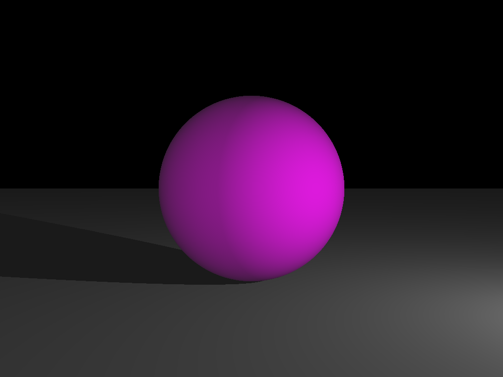

# Qu'est-ce que c'est ?

Ceci est un lanceur de rayon que j'ai programmé suite à mon projet de fin de semestre 4 
lors de ma 2e année de DUT.

## Pourquoi avoir recommencé ?
Celui-ci a subi des bugfix, une restructuration du code ainsi que quelques ajouts (comme l'antialiasing).
Ce projet sera aussi, à long terme, très différent puisque je compte le transformer en moteur de jeu.

# Comment ça marche ?
Créons un projet pas à pas, permettant d'afficher une sphère magenta sur un plan.
Créez un fichier exemple.scene et entrez ce qui suit.
```
# nous donne une taille de 1024 sur 768
size 1024 768

# le nom de sortie de notre fichier avec son extension
# le logiciel sortira toujours un png
output exemple.png

# on défini une caméra
# sa position, vers où regarder (attention l'axe Z se dirige vers vous), le dessus de l'oeil, le champ de vision
camera 0 0 0 0 0 -1 0 1 0 45

# activer ou non les ombres
shadow true

# la lumière ambient
ambient .1 .1 .1
# une lumière directionnelle, avec sa direction et sa couleur
directional 0 0 1 .5 .5 .5
# une lumière ponctuelle, avec sa position et sa couleur
point 3 0 -3 .5 .5 .5

# la lumière diffusé par la sphère
# attention la somme des composantes de diffuse et ambient ne doivent pas dépasser 1
diffuse .9 .0 .9
# la sphère, position et rayon
sphere 0 0 -5 1

diffuse .9 .9 .9
# un plan, un point du plan et sa normale
plane 0 -1 0 0 1 0
```

une fois fais, il faut build le projet avec gradle, le build devrait se trouver dans le dossier
build/libs

exécuter le jar en ligne de commande en donnant la scène comme argument.
Cette scène devrait vous donner l'image ci-dessous


# J'ai un soucis !
N'hésitez pas à ouvrir une issue ou de faire un pull request si vous voulez proposer/rajouter un changement.
